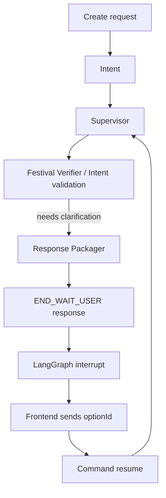
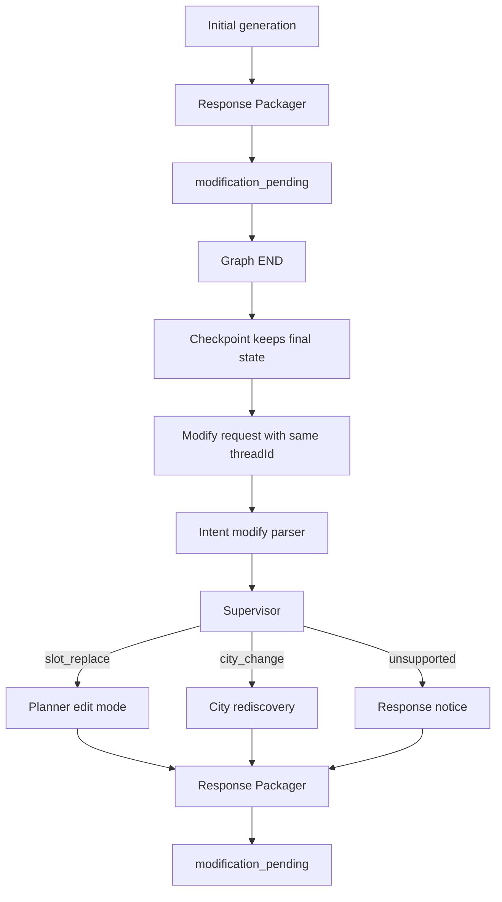

# V2 Modification And Clarification Brief

작성 기준: 현재 `src/lovv_agent_v2` 구현과 `docs/reports/v2/V2_34_MODIFY_INTENT_SCHEMA.md`, `docs/reports/v2/V2_36_INTERRUPT_HANDLING_MATRIX.md`, `docs/reports/v2/V2_38_INTENT_FRONTEND_INPUT_CONTRACT.md`, `docs/reports/v2/V2_39_INTENT_PROCESSING_OUTPUT_SCHEMA.md` 기준.

주의: 이 문서는 **현재 구현**과 **정해진 구조대로 진행될 목표 흐름**을 구분한다. 현재 구현은 `END_WAIT_USER` interrupt, `modification_pending` 응답, checkpoint 기반 confirm 테스트까지 존재한다. 반면 실제 planner edit mode, modify intent op 생성, 자연어 clarification resolver는 아직 후속 구현 대상이다.

## 1. 전체 구분

V2에서 사용자 재입력은 두 종류로 나뉜다.

| 흐름 | 발생 시점 | graph 처리 | responseStatus | checkpoint |
|---|---|---|---|---|
| 재질문 clarification | 생성 중 사용자의 선택 없이는 진행 불가 | LangGraph `interrupt()`로 멈춤 | `END_WAIT_USER` | pending option 보존 |
| 일정 수정 modification | 초회 일정 초안 생성 후 사용자가 수정 요청 | 새 invocation으로 시작 | `modification_pending` 또는 notice | 기존 itinerary/context 복원 |

핵심 차이:

- clarification은 **멈춘 graph를 resume**한다.
- modification은 **끝난 graph의 checkpoint state를 읽어 새로 실행**한다.
- 초회 일정 생성 성공은 최종 완료가 아니라 `modification_pending`이다.
- 사용자가 저장/종료를 명시하기 전까지, 수정 후 결과도 계속 `modification_pending`이다.
- 장기 profile write는 수정 중간이 아니라 사용자가 저장 확정한 `confirm`에서만 일어난다.

## 2. 재질문 흐름



### 2.1 언제 재질문하는가

현재 구조에서 재질문을 실제로 만드는 주 owner는 Festival Verifier다.

| owner | reasonCode | 상황 | 현재 상태 |
|---|---|---|---|
| Festival Verifier | `festival_none` | 요청 월에 확정 축제 후보가 없음 | 구조화 option 생성 대상 |
| Festival Verifier | `festival_tentative` | 잠정 축제만 있음 | 구조화 option 생성 대상 |
| Festival Verifier | `anchor_festival_conflict` | 지정 도시에는 확정 축제가 없음 | 구조화 option 생성 대상 |
| Intent | `contradiction` | 선호/비선호가 충돌 | state 신호는 있음, interrupt 승격 필요 |
| Intent | `underspecified` | 너무 짧거나 정보 부족 | 후속 구현 |
| Intent | `out_of_scope_region` | 한국 외 등 범위 밖 | 후속 구현 |

City Select는 V2.0 기준 clarification option을 만들지 않는다. 전국 discovery에서 도시 후보 0건은 실질적으로 기본 케이스가 아니고, anchored 도시가 얇은 문제는 Planner가 판단한다.

### 2.2 option/apply/then

재질문 option은 서버가 생성한다. 사용자는 `optionId`만 선택한다.

```json
{
  "optionId": "continue_without_festival",
  "label": "축제 없이 계속",
  "apply": {
    "includeFestivals": false,
    "destinationId": null
  },
  "then": "rerun_discovery"
}
```

불변식:

- `apply`와 `then`은 option 생성 시점에 확정된다.
- resume 요청에서 사용자가 `apply`를 새로 보내지 않는다.
- backend는 checkpoint에 저장된 option 원본을 찾아 적용한다.
- Intent는 새 option을 만들지 않고, 기존 option 중 하나로 resolve만 한다.
- 자연어 답변도 최종적으로 기존 `optionId` 하나로 귀결되어야 한다.

현재 허용된 `then` 값:

| then | 의미 |
|---|---|
| `rerun_discovery` | 조건 patch 후 city discovery부터 재시도 |
| `anchor` | 특정 destination anchored 경로로 재진입 |
| `abort` | 현재 run 종료, 조건 재입력 요청 |

수정 clarification을 option resume으로 태우려면 `planner_apply_edit` 또는 `apply_modify` 같은 추가 `then`이 필요하다. 현재 matrix에서는 modify clarification을 별도 option-resume으로 확정하지 않는다.

### 2.3 Festival 재질문 option

`festival_none`:

| optionId | apply | then | 의미 |
|---|---|---|---|
| `continue_without_festival` | `includeFestivals=false` | `rerun_discovery` | 축제 조건 제거 후 도시 탐색 |
| `search_any_festival_theme` | `activeRequiredThemes=[]`, `festivalThemeAgnostic=true` | `rerun_discovery` | 테마 필터 없이 축제 재검색 |
| `revise_conditions` | `{}` | `abort` | 조건 재입력 |

`festival_tentative`:

| optionId | apply | then | 의미 |
|---|---|---|---|
| `accept_tentative_festival:{festivalId}` | tentative risk 수락, destination anchor | `anchor` | 해당 축제 도시로 진행 |
| `continue_without_festival` | `includeFestivals=false` | `rerun_discovery` | 축제 조건 제거 |

`anchor_festival_conflict`:

| optionId | apply | then | 의미 |
|---|---|---|---|
| `continue_without_festival_in_anchor` | 같은 destination, festival off | `anchor` | 지정 도시에서 축제 없이 진행 |
| `switch_to_festival_city:{cityId}` | festival city로 destination 변경 | `anchor` | 축제 있는 도시로 변경 |
| `revise_conditions` | `{}` | `abort` | 조건 재입력 |

### 2.4 재질문 응답 shape

외부 응답은 HTTP error가 아니다. 정상 200 payload로 반환한다.

```json
{
  "responseStatus": "END_WAIT_USER",
  "threadId": "thread-001",
  "requestId": "req-001",
  "recommendationId": null,
  "clarification": {
    "reasonCode": "festival_none",
    "prompt": "요청한 월에 확정된 축제 도시를 찾지 못했습니다. 축제 조건 없이 계속할까요?",
    "options": []
  },
  "responsePayload": {}
}
```

현재 `response_packager_node`는 `response_status == "END_WAIT_USER"`일 때 `interrupt(response_payload)`를 호출한다. AgentCore entrypoint는 interrupt result를 외부 envelope로 감싸 반환한다.

## 3. 일정 수정 흐름



### 3.1 수정은 resume이 아니다

초회 생성 성공 후 graph는 끝나도 된다. 단, checkpointer가 같은 `threadId`의 최종 state를 저장해야 한다.

수정 요청은 다음 정보를 가지고 새 invocation으로 들어온다.

```json
{
  "entryType": "modify",
  "threadId": "thread-001",
  "itineraryRevision": "rev-001",
  "rawModifyQuery": "1일차 오후 장소를 조용한 산책지로 바꿔줘.",
  "currentOrder": {}
}
```

프론트는 `editOps`를 만들지 않는다. `edit_ops`는 Intent가 checkpoint itinerary context를 보고 생성한다.

### 3.2 Modify Intent output

Intent는 `rawModifyQuery`와 checkpoint에서 복원한 itinerary를 기준으로 아래 세 종류 중 하나를 만든다.

| kind | status | routingHint | downstream |
|---|---|---|---|
| `slot_replace` | `ok` | `planner_apply_edit` | Planner edit mode |
| `city_change` | `ok` | `city_select_rediscovery` | City Select 또는 anchored rediscovery |
| `backlog` | `unsupported` | `response_packager_notice` | 기존 일정 유지 + 안내 |

`slot_replace` 예시:

```json
{
  "intent_type": "modification",
  "status": "ok",
  "kind": "slot_replace",
  "routing_hint": "planner_apply_edit",
  "edit_ops": [
    {
      "op_id": "op-1",
      "op": "REPLACE",
      "target": {
        "item_id": "item-2",
        "content_id": "attraction#127691",
        "day": 1,
        "order": 2,
        "resolution": "exact"
      },
      "condition": {
        "replacement_query": "조용하고 한적한 산책지를 천천히 걸을 수 있는 장소.",
        "replacement_query_raw": "조용한 산책지",
        "query_required": true,
        "theme": "자연·트레킹",
        "mood": "quiet",
        "avoid_content_ids": ["attraction#127691"]
      },
      "seed_policy": {
        "target_is_seed": false,
        "policy": "not_seed"
      }
    }
  ]
}
```

V2.0 수정 op 범위는 `REPLACE`만이다. `ADD`, `REMOVE`, `MOVE`, 자연어 reorder-only는 backlog다. 프론트 drag-and-drop으로 이미 바뀐 순서는 `currentOrder`를 현재 truth로 받아들이는 방향이다.

`condition.replacement_query`는 Planner retrieval에 쓰는 HyDE-style 문장이다. 사용자가 "다른 곳으로"처럼 별도 조건 없이 단순 교체만 요청하면 `replacement_query=null`, `replacement_query_raw=null`, `query_required=false`로 둔다. 사용자가 "조용한 숲길"처럼 새 검색 조건을 주면 `replacement_query_raw`에는 짧은 원문 조건을, `replacement_query`에는 검색용 문장을 넣고 `query_required=true`로 둔다.

## 4. Planner Edit Mode 목표 동작

현재 planner edit mode는 계약상 필요하지만 graph에 완전히 붙지 않았다. 정해진 구조대로 구현되면 아래 순서로 동작한다.

### 4.1 checkpoint 복원

Planner edit mode는 새 도시를 고르는 것이 아니라 기존 state를 복원한다.

필요한 context:

- 기존 `responsePayload.itinerary.days`
- planner output 원본 또는 planner scratch
- selected city
- active themes
- festival gate result
- previous seeds
- place pool 또는 재검색 가능한 query context
- current order

checkpoint가 없거나 만료되면 planner edit mode로 들어가지 않는다. 이 경우 "이전 일정 정보를 찾을 수 없어 새 일정 생성이 필요하다"는 안내 응답을 만든다.

### 4.2 slot replacement

단일 replace와 다중 replace는 같은 구조를 쓴다.

1. Intent가 target slot을 `item_id`로 resolve한다.
2. Planner는 target slot의 day/order/theme/subtype/context를 읽는다.
3. `replacement_query`가 있으면 그 문장을 slot-local retrieval query로 사용한다.
4. 없으면 기존 item의 theme/subtype/slot context를 query로 삼는다.
5. 선택 도시 안에서 replacement candidates를 조회한다.
6. `avoid_content_ids`에 기존 item을 넣어 같은 장소 재선택을 막는다.
7. 성공한 op를 모두 모은 뒤 한 번에 itinerary에 적용한다.
8. 전체 일정을 단일 재배치/재스코어한다.

다건 수정은 순차 적용하지 않는다. 순차 적용은 첫 번째 수정 결과가 두 번째 target resolution이나 동선에 영향을 주기 때문이다. 모든 op를 독립적으로 후보 조회한 뒤 한 번에 반영한다.

### 4.3 seed 정책

초기 V2 문서의 "seed는 무조건 수정 불가" 정책은 최신 계약에서 바뀌었다.

| target | 처리 |
|---|---|
| non-seed | 일반 replace 가능 |
| seed + same-theme request | 같은 theme replacement 가능 |
| seed + different-theme request | clarification 또는 unsupported |
| seed + city change | slot replace가 아니라 city rediscovery |

seed replacement가 허용되더라도 planner는 새 seed가 기존 anchor 역할을 이어받을 수 있는지 확인해야 한다. theme가 바뀌거나 itinerary skeleton이 흔들리면 slot replace가 아니라 더 큰 재생성 요청으로 분류한다.

### 4.4 이동 시간과 public response

수정 중 slot swap은 내부적으로 leg calculation을 다시 해야 한다.

- ORS가 있으면 ORS duration matrix를 사용한다.
- 없으면 Haversine duration fallback을 사용한다.
- day total, max leg, compactness를 재평가한다.

다만 최종 public response에서 장소별 이동 시간을 핵심 계약으로 노출하지 않는다. 이동시간은 slot 교체가 가능한지, day route가 과도하게 길지 않은지 판단하는 내부 배치 신호로 둔다. UI에서 상세 이동 표시는 front 영역으로 둔다.

## 5. City Change

도시 변경은 planner edit mode가 아니라 city rediscovery다.

```json
{
  "intent_type": "modification",
  "status": "ok",
  "kind": "city_change",
  "city_change": {
    "target_city_id": "KR-47-130",
    "target_city_name": "경주시",
    "city_preference_query": "경주로 바꿔줘",
    "carry_over_themes": true,
    "carry_over_festivals": true,
    "avoid_city_ids": ["KR-51-150"]
  },
  "routing_hint": "city_select_rediscovery"
}
```

처리 원칙:

- 도시 id가 확정되면 anchored path로 재생성한다.
- 도시 id가 없고 선호 문장만 있으면 city discovery query에 반영한다.
- 기존 themes는 기본적으로 유지한다.
- 기존 festival mode도 기본적으로 유지한다.
- 사용자가 "축제는 빼고"처럼 명시하면 festival flag를 바꾼다.
- 이전 도시는 `avoid_city_ids`에 넣어 같은 도시 재선택을 막는다.

## 6. Unsupported / Clarification In Modification

수정 요청이 실행하기 위험하면 Intent가 `needs_clarification` 또는 `unsupported`를 만든다.

Clarification 대상:

| case | reason |
|---|---|
| target item unresolved | 어떤 장소를 바꿀지 모름 |
| target ambiguous | 후보 item이 여러 개 |
| same slot contradictory | 한 슬롯에 상충 조건 |
| multiple ops conflict | 다건 op끼리 충돌 |
| seed different-theme change | seed anchor 의미 훼손 |
| city ambiguous | 도시명이 여러 city id로 resolve |

Unsupported 대상:

| reason | 의미 |
|---|---|
| `add_place` | 장소 추가 |
| `remove_place` | 장소 삭제 |
| `reorder_only` | 자연어 순서 변경만 요청 |
| `reset_all_without_city_target` | 전체 리셋이지만 도시/조건 없음 |
| `trip_length_change` | 여행 길이 변경 |
| `travel_month_change` | 여행 월 변경 |
| `transport_mode_replan` | 이동수단 기반 전체 재계획 |
| `whole_itinerary_mood_rebuild` | 전체 무드 재구성 |
| `reservation_or_booking` | 예약/식당/숙소 등 범위 밖 |

V2.0에서는 modify clarification을 기존 `then=anchor|rerun_discovery|abort`에 억지로 태우지 않는다. target ambiguity 같은 경우는 우선 `END_WAIT_USER` 또는 notice로 사용자에게 다시 요청하고, 다음 modify utterance에서 다시 parse하는 쪽이 안전하다.

## 7. Confirm / Profile Write

사용자가 일정 초안을 저장 확정하면 `confirm`으로 들어온다.

```json
{
  "entryType": "confirm",
  "threadId": "thread-001",
  "recommendationId": "rec-001",
  "itineraryRevision": "rev-001"
}
```

처리:

1. checkpoint에서 최종 itinerary와 theme context를 읽는다.
2. Profile Agent가 확정된 일정 기준으로 theme counts를 업데이트한다.
3. graph는 terminal END로 끝난다.

Profile write 대상이 아닌 것:

- 초회 생성만 완료된 `modification_pending`
- 수정 중간 발화
- clarification answer
- unsupported modify notice

## 8. Response Status 정리

| responseStatus | 의미 | 사용자 다음 행동 |
|---|---|---|
| `modification_pending` | 초안 또는 수정 결과가 준비됨 | 추가 수정 또는 저장 확정 |
| `END_WAIT_USER` | 진행 전에 선택/답변 필요 | option 선택 또는 답변 |
| terminal END | 저장 확정 처리 완료 | 없음 |

`modification_pending`은 실패가 아니다. V2 UX에서 "수정 가능한 초안"의 정상 완료 상태다.

`END_WAIT_USER`도 실패가 아니다. 서버가 더 진행하면 안 되는 분기에서 사용자 선택을 기다리는 정상 상태다.

## 9. 현재 구현 상태

구현됨:

- 초회 생성 결과를 `modification_pending`으로 포장
- `END_WAIT_USER`에서 `response_packager_node`가 LangGraph `interrupt()` 호출
- AgentCore entrypoint에서 `resumeValue`를 `Command(resume=...)`로 변환
- `MemorySaver` 기준 `modification_pending` 이후 같은 thread에서 confirm/profile update 테스트
- Festival Verifier의 구조화 clarification 모델과 gate result
- Modify intent schema 문서와 parser placeholder

남은 작업:

- Intent의 `entryType=create|clarify|modify|confirm` 명시 dispatch
- button `optionId`를 checkpoint pending option으로 resolve
- 자연어 clarification answer resolver
- `festival_none.search_any_festival_theme` option과 resume patch 반영
- modify intent의 `slot_replace`, `city_change`, `backlog` 실제 생성
- planner edit mode
- city change rediscovery routing
- checkpoint missing/expired modify response
- modify clarification의 최종 option/then 정책 확장 여부 결정

## 10. 수락 기준

재질문:

- `festival_none`이면 `END_WAIT_USER`와 `continue_without_festival`, `search_any_festival_theme`, `revise_conditions` option이 반환된다.
- 사용자가 `continue_without_festival`을 선택하면 같은 `threadId`로 resume되어 festival verifier를 건너뛰고 city discovery로 진행한다.
- 사용자가 `search_any_festival_theme`를 선택하면 theme filter 없이 festival verifier를 다시 실행한다.
- 자연어 "축제 빼고 계속"은 후속 resolver 구현 후 기존 option id로 resolve된다.

수정:

- 초회 생성 성공 후 response는 `modification_pending`이다.
- 같은 `threadId`의 modify request는 checkpoint itinerary를 복원한다.
- single replace는 target slot만 바꾸고 전체 route를 다시 평가한다.
- multiple replace는 각 op 후보를 조회한 뒤 한 번에 적용한다.
- seed same-theme replace는 허용 가능하고, seed different-theme replace는 실행하지 않는다.
- city change는 planner edit mode가 아니라 city rediscovery로 간다.
- checkpoint가 없으면 planner를 실행하지 않고 새 일정 생성 안내를 반환한다.
- 저장 확정 confirm에서만 profile write가 발생한다.
