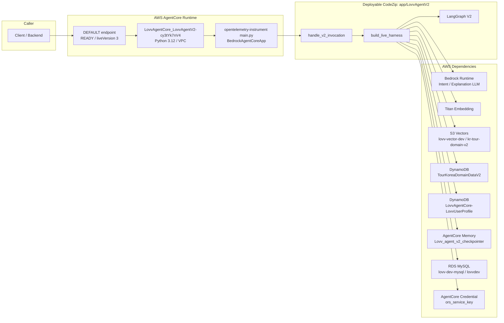
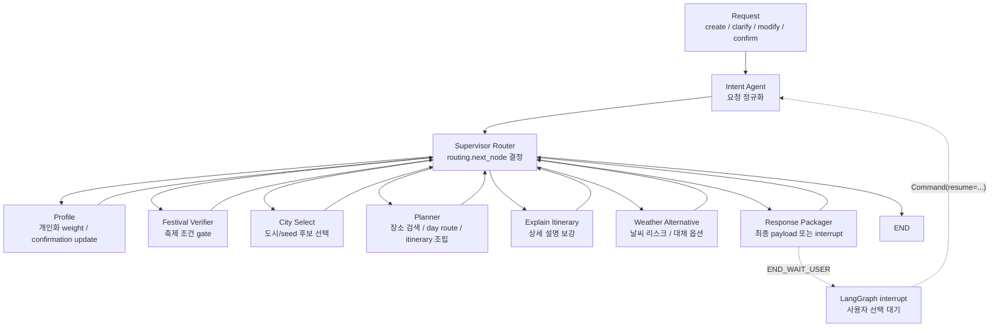
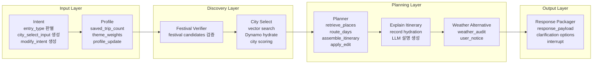
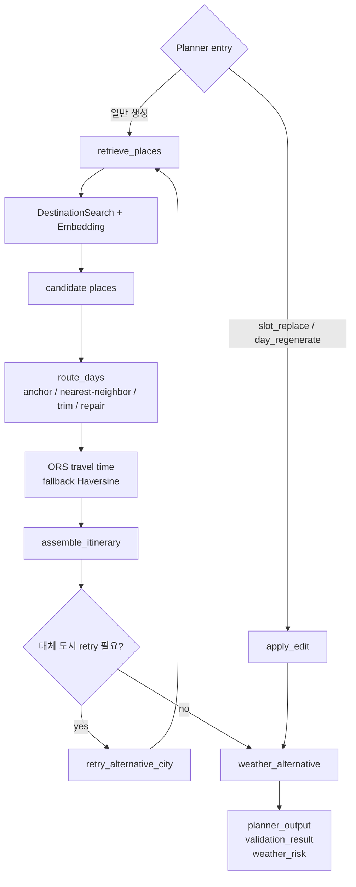
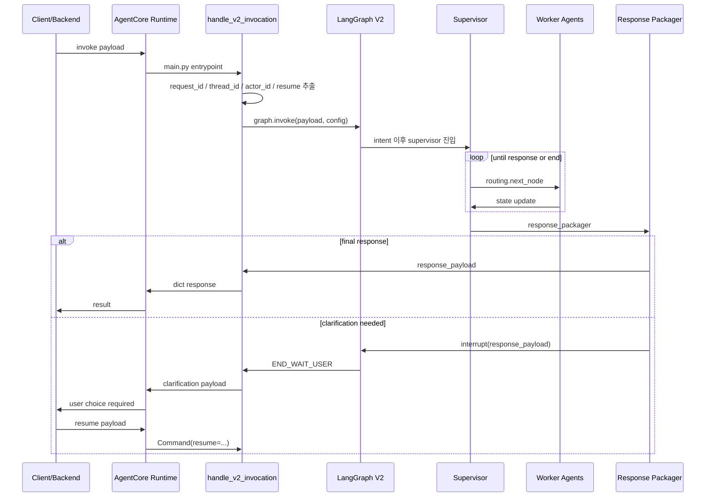

# Lovv Agent V2 Readable Architecture Mermaid

작성일: 2026-07-08

이 문서는 발표/공유용으로 읽히는 Agent V2 아키텍처다. 세부 node를 전부 펼치기보다, 먼저 경계와 책임이 보이도록 5개 Mermaid로 나눴다.

## 1. Runtime Boundary

## 2. Supervisor Spine

## 3. Agent Responsibility Map

## 4. Planner Internal Flow

## 5. Request Lifecycle

## Key Notes

- 현재 live V2 runtime은 `LovvAgentCore_LovvAgentV2-cy3tYk7nV4`이고 `READY`, `liveVersion=3`이다.
- 실제 배포 기준 코드는 `app/LovvAgentV2/`이다. `src/lovv_agent_v2/`는 개발 소스지만 AgentCore CodeZip 기준 truth surface는 아니다.
- Supervisor는 전체 worker를 직접 실행하는 agent가 아니라 deterministic router다. 핵심 출력은 `routing.next_node`다.
- 일반 생성 흐름은 `Intent -> Profile -> Festival -> City Select -> Planner -> Explain -> Weather -> Response`로 읽으면 된다.
- `Response Packager`만 사용자 대기를 만들 수 있다. 이때 LangGraph `interrupt`가 발생하고 다음 호출은 `Command(resume=...)`로 이어진다.
- live AWS는 VPC 배포다. 로컬 `agentcore/agentcore.json`의 `networkMode=PUBLIC`과 현재 live 상태가 다르다.
