# Lovv Agent V2 구조 Mermaid

작성일: 2026-07-08

이 문서는 현재 코드와 live AWS 배포 상태를 함께 기준으로 만든 Agent V2 구조도이다.

- 코드 기준: `agentcore/agentcore.json`의 `codeLocation=app/LovvAgentV2/`
- 배포 기준: AWS AgentCore runtime `LovvAgentCore_LovvAgentV2-cy3tYk7nV4`
- 상태: `READY`, live endpoint `DEFAULT`, live version `3`
- 런타임: `PYTHON_3_12`, entrypoint `opentelemetry-instrument main.py`
- 네트워크: live AWS는 `VPC`, 로컬 `agentcore/agentcore.json`은 `PUBLIC`으로 남아 있어 현재 배포 상태와 로컬 설정 파일이 다르다.

## 근거 파일과 live 리소스

### 코드 근거

- `app/LovvAgentV2/main.py`: `BedrockAgentCoreApp` entrypoint에서 `handle_v2_invocation` 호출
- `app/LovvAgentV2/lovv_agent_v2/agentcore_entrypoint.py`: request/thread/actor/resume 추출, profile evidence 주입, graph invoke
- `app/LovvAgentV2/lovv_agent_v2/harness.py`: live runtime 도구 조립, checkpointer 생성, graph compile
- `app/LovvAgentV2/lovv_agent_v2/core/graph.py`: LangGraph V2 node와 supervisor conditional route 구성
- `app/LovvAgentV2/lovv_agent_v2/agents/supervisor/router.py`: `routing.next_node` 결정 규칙
- `app/LovvAgentV2/lovv_agent_v2/agents/*`: 각 agent node와 subgraph 구현

### live AWS 근거

- AgentCore runtime: `arn:aws:bedrock-agentcore:us-east-1:925273580929:runtime/LovvAgentCore_LovvAgentV2-cy3tYk7nV4`
- Runtime version: `3`
- Runtime status: `READY`
- Endpoint: `DEFAULT`, `READY`, `liveVersion=3`
- Code artifact: `s3://cdk-hnb659fds-assets-925273580929-us-east-1/cae5386e060ec1dc42147f4923f6812e9e9e629abbfe2dab643689c4628c2bff.zip`
- AgentCore Memory: `Lovv_agent_v2_checkpointer-OUxTJ7HuIM`, `ACTIVE`, `eventExpiryDuration=7`
- DynamoDB domain table: `TourKoreaDomainDataV2`, `ACTIVE`, `ItemCount=10482`
- DynamoDB profile table: `LovvAgentCore-LovvUserProfile`, `ACTIVE`, `ItemCount=0`
- S3 Vector index: `lovv-vector-dev/kr-tour-domain-v2`, `float32`, dimension `1024`, cosine
- RDS: `lovv-dev-mysql`, MySQL, `available`, port `3306`

## 1. 큰 틀: AgentCore Runtime과 Supervisor Route

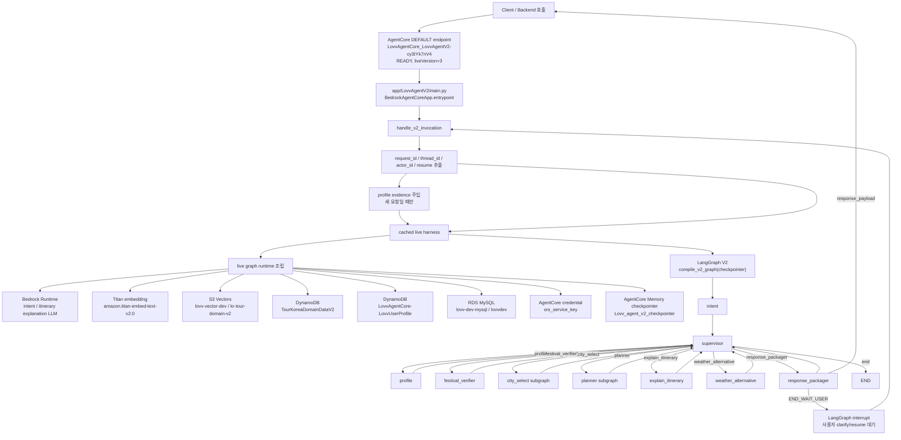

## 2. Supervisor Routing 상세

`supervisor_node`는 매번 `routing.next_node`를 갱신한다. 그래프 자체는 모든 worker를 supervisor로 되돌리고, `_route_from_supervisor`가 `routing.next_node`를 다음 LangGraph node로 매핑한다.

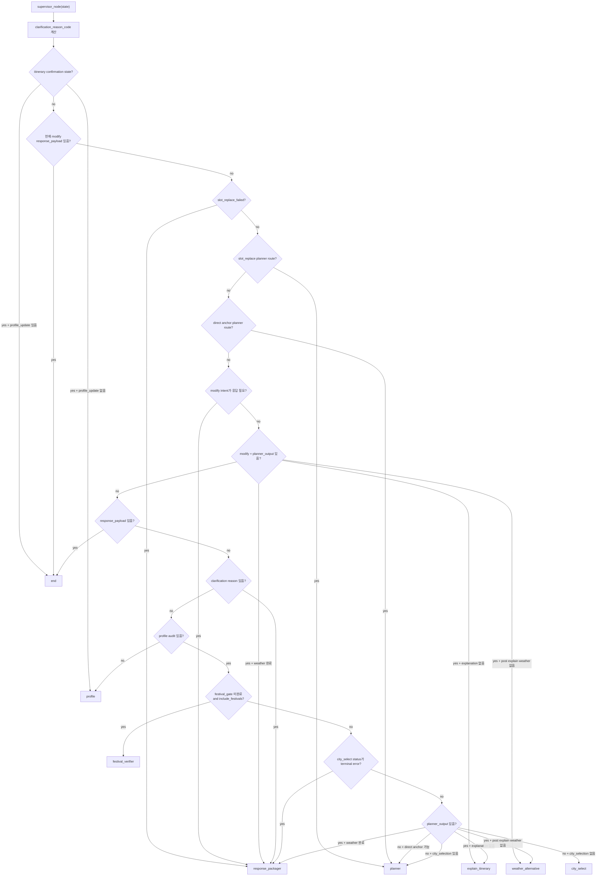

## 3. Intent Agent

역할: 입력을 `create | clarify | modify | confirm`로 정규화하고, `city_select_input` 또는 `modify_intent`를 만든다.

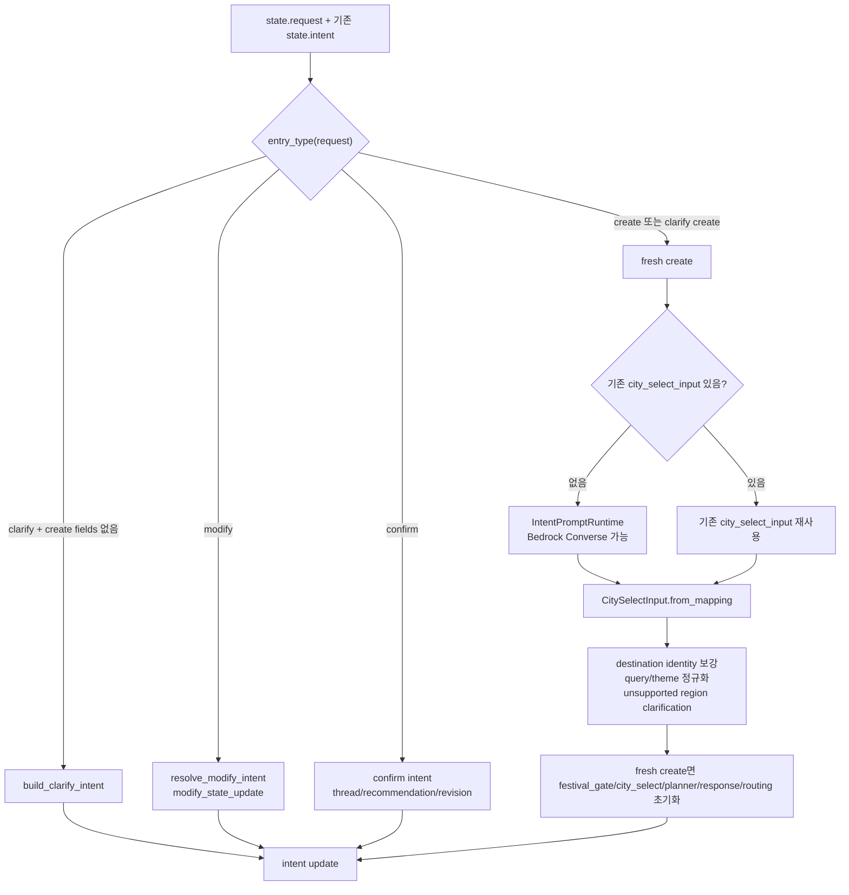

## 4. Profile Agent

역할: 사용자 profile과 saved itinerary evidence를 바탕으로 theme weight를 계산하고, confirmation이면 profile update payload를 기록한다.

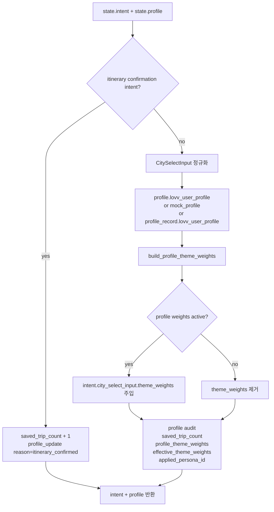

## 5. Festival Verifier Agent

역할: 요청 또는 기존 festival candidates를 받아 선택 도시/테마/월 기준으로 festival gate를 검증한다.

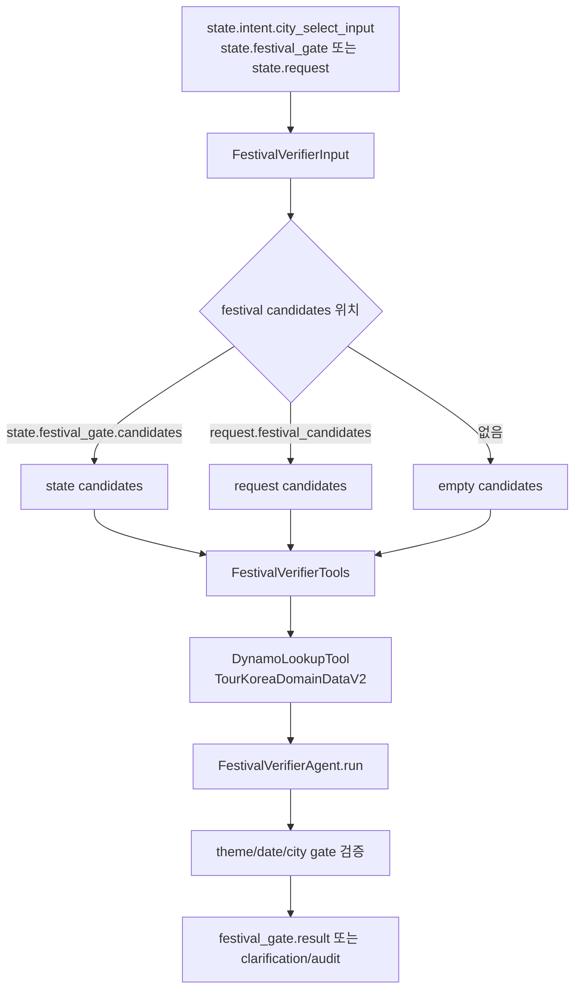

## 6. City Select Agent

역할: S3 Vectors로 후보 도시/장소를 검색하고 DynamoDB detail을 보강한 뒤 도시를 선택한다.

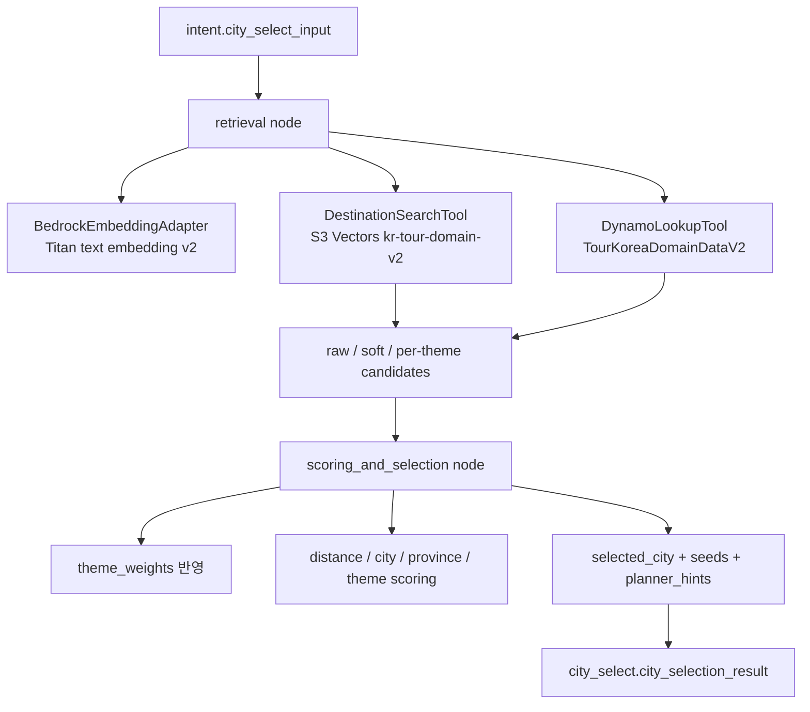

## 7. Planner Agent

역할: 선택 도시 안에서 실제 itinerary 후보를 만들고 route/day 배치를 수행한다. modify 요청 중 `slot_replace` 또는 `day_regenerate`는 `apply_edit` 경로로 들어간다.

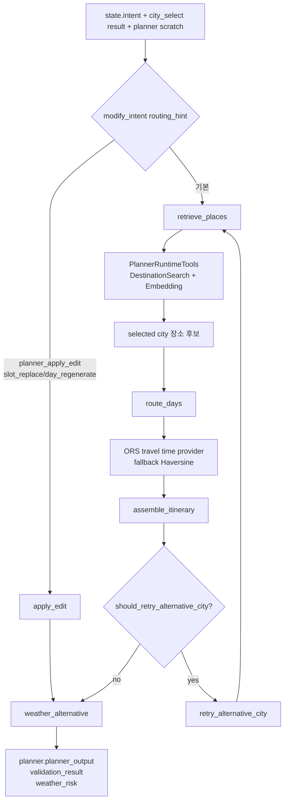

## 8. Explain Itinerary Agent

역할: planner output의 장소별 설명과 사용자-facing itinerary 설명을 보강한다.

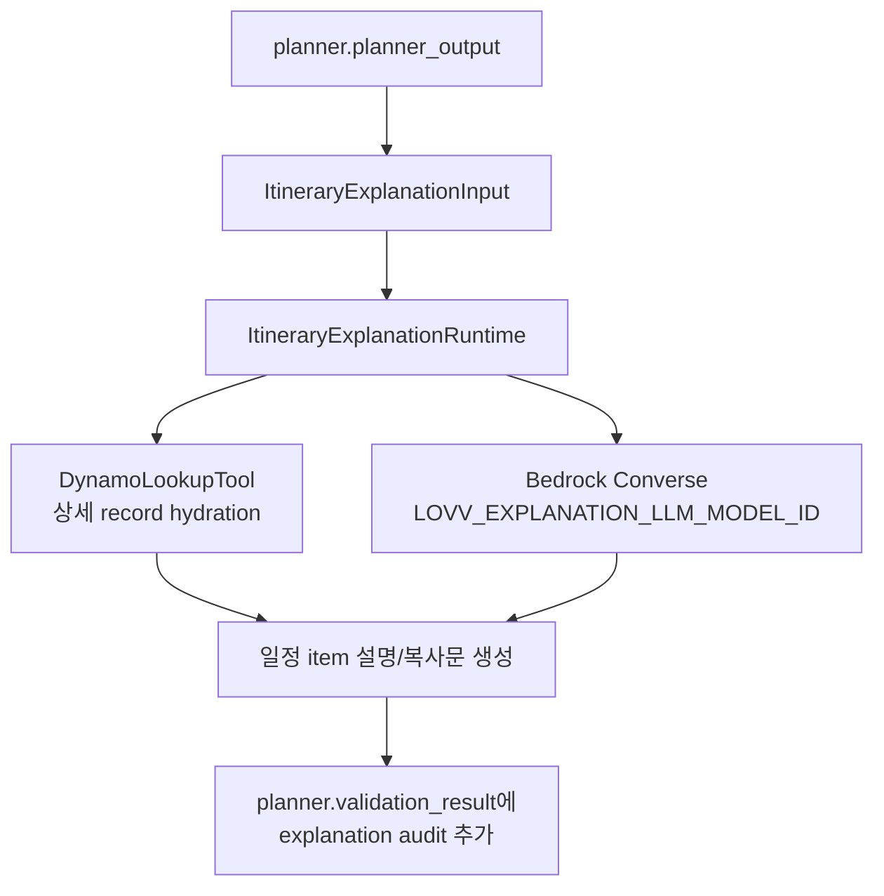

## 9. Weather Alternative Agent

역할: 완성된 itinerary의 실내/실외 노출과 도시/월별 weather risk를 비교해 날씨 안내 또는 대체 일정 옵션을 만든다.

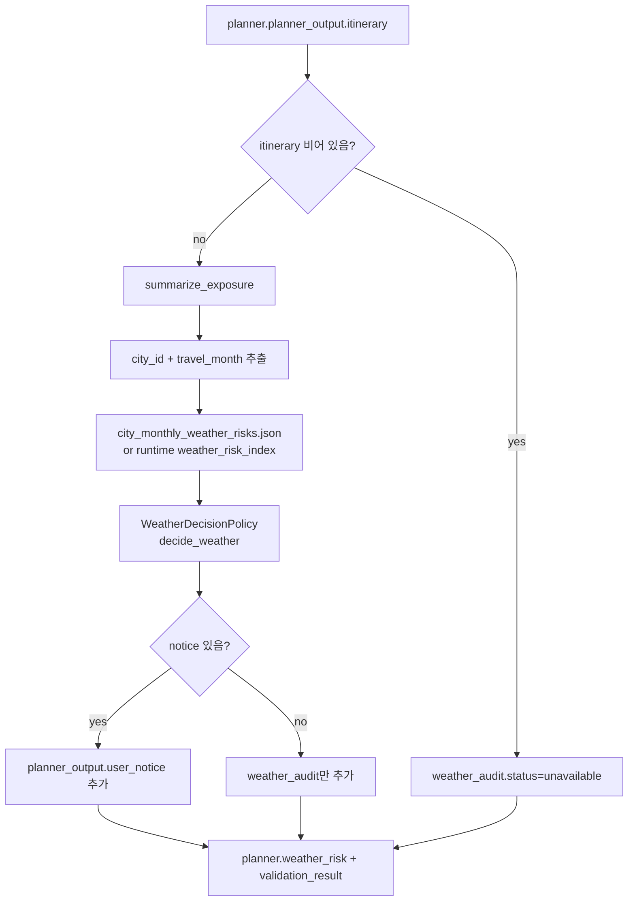

## 10. Response Packager Agent

역할: 최종 응답 payload를 만들거나, clarify/대체 일정/후보 부족 상황이면 LangGraph interrupt로 사용자 선택을 기다린다.

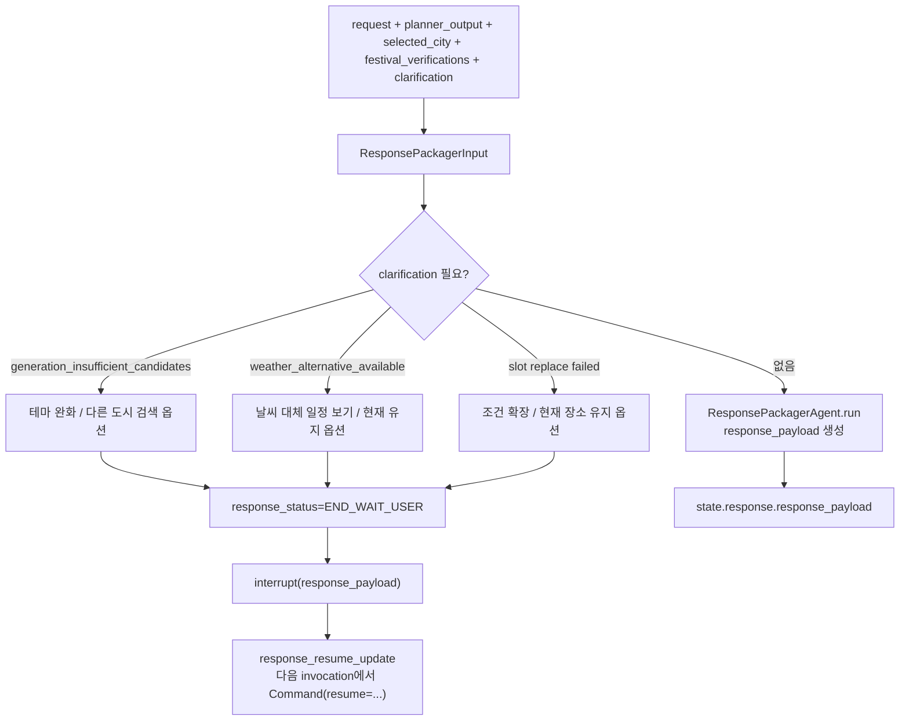

## 11. 배포 런타임과 코드 설정 차이

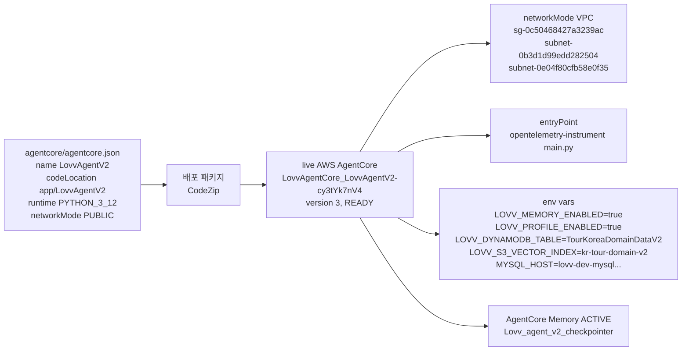

## 12. 요약

- 현재 배포된 Agent는 V2이며, live runtime id는 `LovvAgentCore_LovvAgentV2-cy3tYk7nV4`이다.
- 실제 배포 코드는 `app/LovvAgentV2/`가 기준이다. `src/lovv_agent_v2/`는 개발 소스이지만 AgentCore `CodeZip` 기준 truth surface는 아니다.
- Supervisor는 LLM supervisor가 아니라 deterministic router다. `routing.next_node`를 계산하고, LangGraph conditional edge가 그 값을 실제 node로 라우팅한다.
- 기본 생성 흐름은 `intent -> supervisor -> profile -> supervisor -> festival_verifier -> supervisor -> city_select -> supervisor -> planner -> supervisor -> explain_itinerary -> supervisor -> weather_alternative -> supervisor -> response_packager`이다.
- modify/clarify/confirm은 `intent`와 `supervisor`에서 분기된다. `response_packager`는 사용자 입력이 더 필요하면 `interrupt`로 멈추고 다음 호출에서 `Command(resume=...)`로 이어진다.
- live AWS는 VPC 네트워크로 배포되어 있고, 로컬 `agentcore/agentcore.json`의 `networkMode=PUBLIC`과 다르다.
