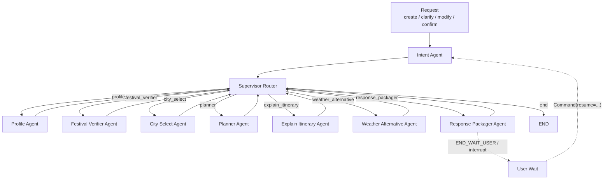
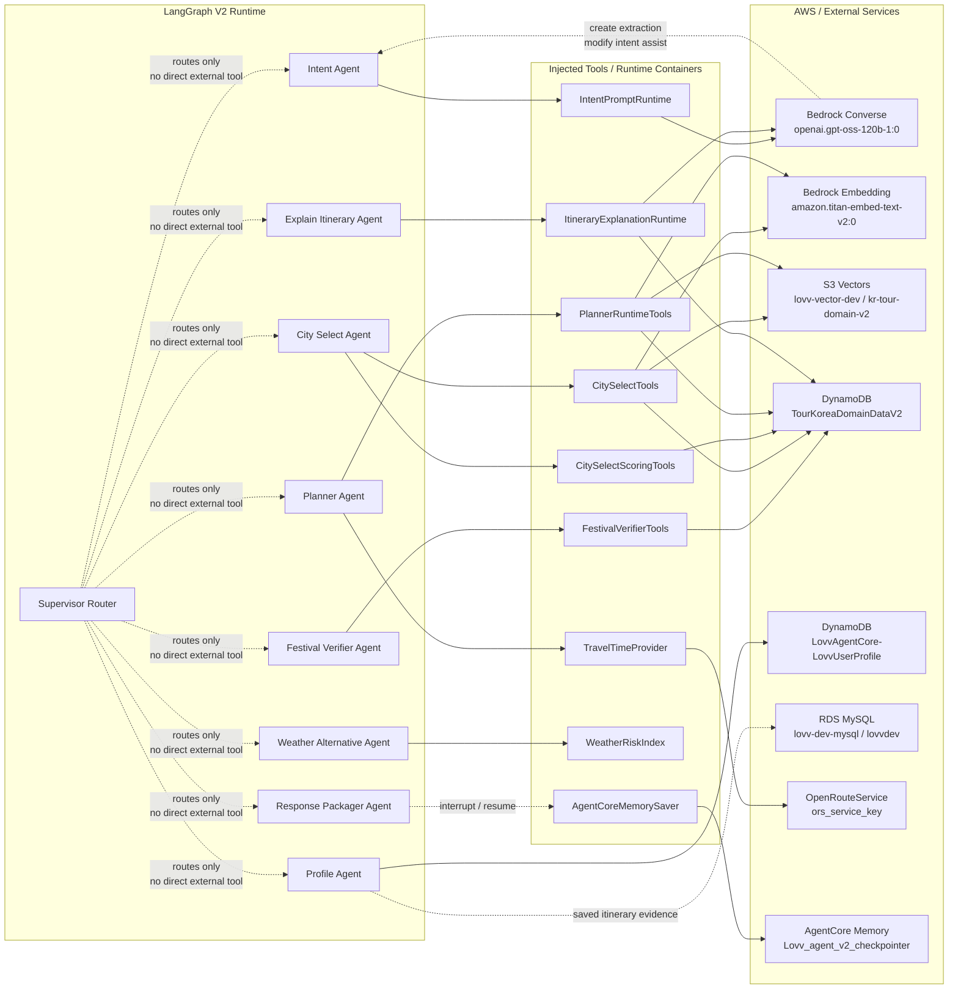

# Lovv Agent V2 Agent/Supervisor and Tool Graph

작성일: 2026-07-08

이 문서는 두 가지 관점만 담는다.

1. 전체 구조도: Agent와 Supervisor만 보이게 단순화한다.
2. Tool 구조도: 각 Agent가 사용하는 tool/runtime 의존성을 LangGraph처럼 연결한다.

## 1. Agent + Supervisor 전체 구조도

## 2. Agent Tool Graph

## Notes

- `Supervisor Router`는 tool을 직접 호출하지 않고 `routing.next_node`만 결정한다.
- 실제 배포 기준 코드는 `app/LovvAgentV2/`이다.
- AgentCore runtime은 `LovvAgentCore_LovvAgentV2-cy3tYk7nV4`, live version `3`, status `READY` 기준이다.
